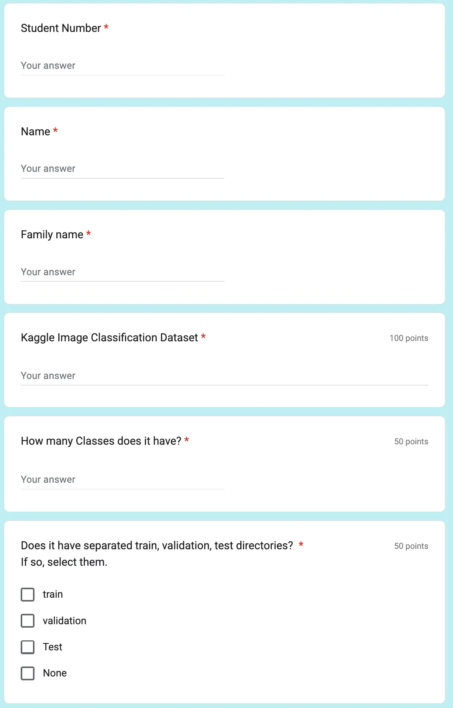
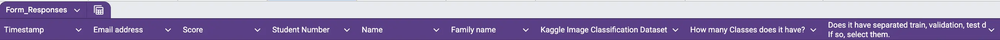

# Process Google Form data using Appscript

## Introduction

For the first assignment of **Deep Learning** students, I gave them a task
to find an **Image Classification** Dataset from **Kaggle**.
Their dataset should follow a specific directory structure.
Also, they should tell how many classes it has, also it is separated into
**Train**, **Validation**, and **Test**, or not.
To do so, I have prepared a **Google Form**.
You can see the main structure of this form in the following:



I also have a **Google Sheet** that I put their marks in there.
To make my job easier, at first, I export their responses to a **Google Sheet**.
Then, I programmed a script in **AppScript** in **Google Sheet** to copy their
responses to their mark **Google sheet**.
The columns in their row responses look like below:



## Find the last submission

In this form, students are allowed to submit as many times as they want.
I only use their last submission.
So, my first job is to find their last submission.
To do that, I wrote the function below:

```javascript
function find_last_one(document, sheet_name) {
  var sheet = document.getSheetByName(sheet_name);

  if (!sheet) {
    throw new Error("Sheet with name '" + sheet_name + "' not found.");
  }

  var range = sheet.getDataRange();
  var values = range.getValues();


  var newValues = [];
  var students_numbers = [];


  for (var i = values.length - 1; i > 0; i--) {
    var row = values[i]; // Access the current row (an array)

    if (!students_numbers.includes(row[3])) {
      students_numbers.push(row[3]);
      newValues.push(row);
    }

  }

  newValues = newValues.reverse();

  return newValues;

}
```

The function above takes a `document` and a `sheet_name`.
Then it iterates through all the rows in reverse (to find the last submission).
It adds their `student_number` (column 3) to a list called `student_numbers`.
If their `student_number` wasn't in `student_numbers`, it would add
their row to the `newValues`.
Then it would reverse the `newValues` and return them.

## Check Duplicate Datasets

I wanted everyone's dataset to be unique.
To check if their dataset is not the same as the other students,
I have written the following function:

```javascript
function check_duplicate_dataset(r_values) {

  result = [];

  datasets = [];

  for (var i = 0; i < r_values.length; i++) {
    var dataset_link = r_values[i][6];
    dataset_link = dataset_link.trim();
    dataset = dataset_link.split("/");
    dataset = dataset[4].replace("\n", "") + "/" + dataset[5].split("?")[0];

    result.push(r_values[i]);
    result[i].push(dataset);

    if (!datasets.includes(dataset)) {
      datasets.push(dataset);
    } else {
      result[i][9] = "*****duplicate****** " + result[i][9];
    }

  }
  return result;

}
```

This function takes the values that we made from `find_last_one` as its argument.
Then, I have a for loop that iterates through them.
The format of each dataset link (column 6) is like this:
<https://www.kaggle.com/datasets/balabaskar/tom-and-jerry-image-classification>.
So, the thing that I should do to find the dataset ID is to split the URL with
`/`.
Then, take the fourth and fifth ones and combine them with `/`.
Before combining, I do some trimming as well.
Because some of the links aren't as clean as I would have expected.
Then, I push that dataset at the end of the row of values.
After that, I check if it existed before or not.
Because my values are ordered by date, only the dataset that has been sent
later would be tagged as `duplicate`.

## Copy to Mark's Google Sheet

The next thing that I should do is to copy all the data into the Mark's sheet.
To do so, I have written the function below:

```javascript

function add_to_marks(target_document, sheet_name, r_values) {

  var sheet = target_document.getSheetByName(sheet_name);

  if (!sheet) {
    throw new Error("Sheet with name '" + sheet_name + "' not found.");
  }

  var range = sheet.getDataRange();
  var values = range.getValues();

  for (var i = 0; i < values.length; i++) {
    var index = -1;
    for (var j = 0; j < r_values.length; j++) {
      if (r_values[j][3] == values[i][2]) {
        index = j;
      }
    }
    if (index != -1) {
      r_cell = sheet.getRange(`F${i + 1}`);

      console.log(`${r_values[index][3]} ${r_values[index][4]} ${r_values[index][5]} ${r_values[index][9]}`);

      var richTextBuilder = SpreadsheetApp.newRichTextValue()
        .setText(r_values[index][9])
        .setLinkUrl(r_values[index][6].trim().replace("\n", ""));
      var richTextValue = richTextBuilder.build();

      r_cell.setRichTextValue(richTextValue);

      r_separate = sheet.getRange(`H${i+1}`);
      r_separate.setValue(r_values[index][8]);

      r_num = sheet.getRange(`I${i + 1}`);
      if(typeof r_values[index][7] == "string"){
        r_values[index][7] = parseInt(r_values[index][7]);
      }
      r_num.setValue(r_values[index][7]);

    }

  }

}

```

This function takes `target_document`, `sheet_name`, and `r_values` as its arguments.
Then, it iterates through the rows of Mark's sheet.
In Mark's sheet, the `student_number` is in column 2.
So, we check if the student with this `student_number` has submitted anything
or not.
If they have submitted, we find the `index` of their submission in `r_values`.
After that, we create a link to the dataset and put it in `F${i+1}`.
Then, we put their separation directories (train, valid, test) in `H${i+1}`.
Finally, we trim the number of classes that they have submitted and put it
in `I${i+1}`.

## Conclusion

To automatically put students' submissions in a **Google Sheet**, I have provided
a simple and effective code in **Appscript**.
The code first finds their last submission.
After that, it finds the duplicates.
Finally, it copies their marks to **Google Sheet**.
This code has made the grading and checking super easy and faster for me.